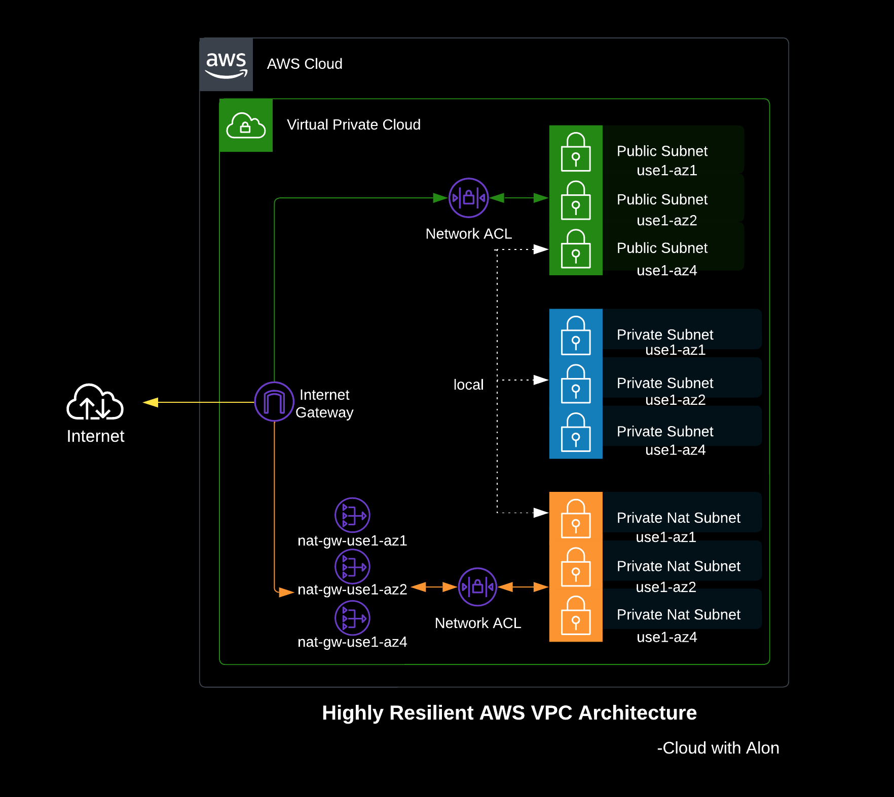

# AWS VPC CloudFormation Template for a Highly Resilient Architecture

## Overview

This project provides an AWS CloudFormation template for creating a highly resilient Virtual Private Cloud (VPC) architecture across three Availability Zones (AZs). The template includes a well-structured network layout featuring public, NAT, and private subnets, along with the necessary routing components.

## Features

- **Highly Resilient Architecture**: Utilizes multiple Availability Zones (3 AZs) to ensure high availability and fault tolerance.
- **Public, NAT and Private Subnets**: Configures public subnets for internet-facing resources, private NAT subnets for secure outbound internet access, and private subnets for internal resources.
- **NAT Gateways**: Deploys NAT gateways across multiple Availability Zones (AZs) to ensure high availability.
- **Flexible Configuration**: Allows customization of CIDR blocks, subnet sizes, and availability zones through parameters.
- **Network ACLs**: Implements Network Access Control Lists (NACLs) for added security at the subnet level.

## Architecture Diagram



## Prerequisites

- An AWS account with necessary permissions to create VPCs, subnets, NAT gateways, and other related resources.
- AWS CLI.

## Usage

1. **Clone the repository**:
   ```bash
   git clone https://github.com/alonshrestha/aws-vpc-resilient-architecture.git
   cd aws-vpc-resilient-architecture/cloudformation 
   ```

2. **Update Parameters**: Modify the `parameters.json` file to set the desired values for your project, including:
   - `ProjectName`: Your project name.
   - `Environment`: Environment type (e.g., dev, staging, production).
   - `VpcCidr`: CIDR block for the VPC.
   - `PublicSubnets`, `PrivateNatSubnets`, `PrivateSubnets`: CIDR blocks for subnets.
   - `AvailabilityZones`: List of available AZs.

3. **Deploy the CloudFormation Stack**:

   - Using the AWS CLI:
     ```bash
     aws cloudformation create-stack --stack-name YourStackName --template-body file://vpc.yaml --parameters file://parameters.json
     ```

4. **Monitor Stack Creation**: Monitor the progress of the stack creation in the AWS Management Console.

## Customization

Feel free to customize the template as per your requirements. You can add additional resources like EC2 instances, RDS databases, and more.

## Security Considerations

- Review and modify NACLs rules based on your security requirements.

## Contributing

Contributions are welcome! Please open an issue or submit a pull request for any improvements or enhancements.

## License

This project is licensed under the MIT License. See the [LICENSE](LICENSE) file for details.

## Acknowledgments

- AWS Documentation
- CloudFormation Template Examples
```
Feel free to modify the sections as needed and add any additional information specific to your project!